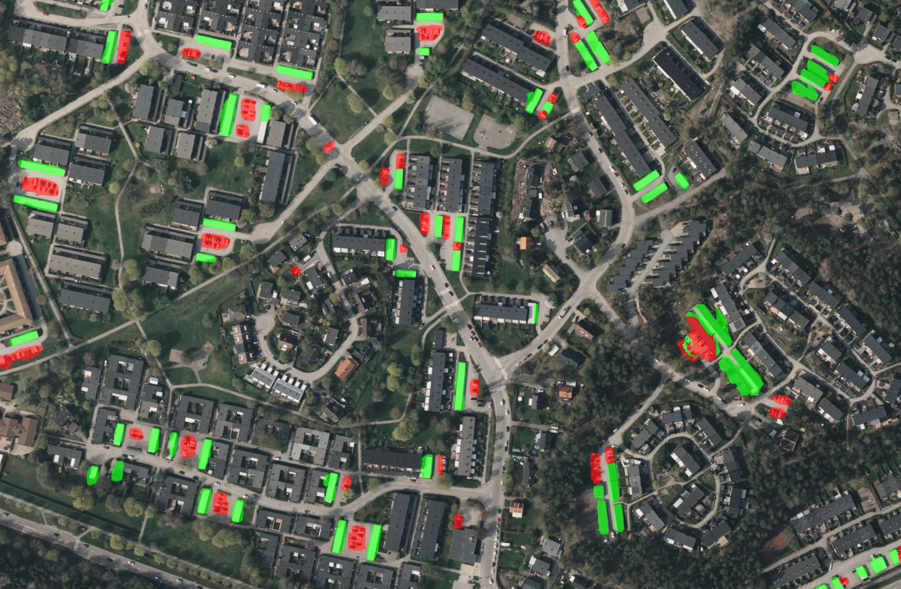

# ParkPulse

Note: Documentation is under construction. Currently the [`ParkPulse-Website`](https://github.com/Marbjo07/ParkPulse-Website) repo provides the most info.

## Setup

This repo serves as a dev enviroment and release pipeline for `ParkPulse-Website`, `ParkPulse-AccessManager` and `BRF-Engine`.

### 1. Clone the repository

```bash
git clone https://github.com/Marbjo07/ParkPulse.git
cd ParkPulse
git submodule update --init --recursive
```

### 2. Define .env files

The proccess is defined in each of the repos.  
Template env files coming soon...

### 3. Build

```bash
docker compose -f docker-compose.dev.yml up --build
```

### 4. Open the app in your browser

Visit [http://localhost:8080](http://localhost:8080) in your browser.  
Then just press login, since authentication was disabled.

## About

The build and deployment process is automated using Azure DevOps, with Docker containers for both the frontend and backend services.

For further details on each component, see the documentation in the relevant submodules:

[ParkPulse-Website](https://github.com/Marbjo07/ParkPulse-Website)  
[ParkPulse-AccessManager](https://github.com/Marbjo07/ParkPulse-AccessManager)  
[BRF-Engine](https://github.com/Marbjo07/BRF-Engine)  
ParkPulse-AI: repo coming soon

## Screenshot



## Technologies Used

- Docker
- Azure Maps
- Azure Pipelines
- Flask / Spring Boot (Kotlin)
- YOLOv8 and SAM for AI
- Microsoft Entra ID for authentication
- Session-based User Management

## Contact

For questions or more details, feel free to contact me via email at [marius.bjorhei@gmail.com](marius.bjorhei@gmail.com).
